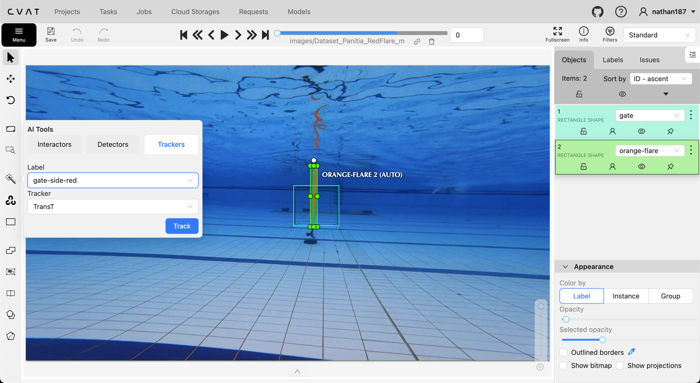
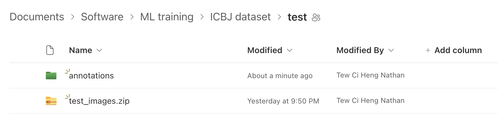

# Annotation of datasets for Perception's Object Detection ML model
## Introduction
Perception will be training and using YOLOv8's object detection model in order to recognise the targets and obstacles during the SAUVC tasks. 

(We'll be using bounding box annotation rather than other methods like pixel-tight/polygon as the objects we're dealing with are relatively simple shapes, and the background is also relatively plain, so bounding boxes would suffice for accuracy and are much faster to work with ~Nathan's unbacked personal note)

H9 has already trained a model which works pretty well on the data that we currently have, so the next step is to find/record more varied data (with different lighting, combination of objects, etc.) for training a more robust model.

In addition, as per @leftoverrice's suggestion, we'll be adding 3 additional labels to their existing model: gate-side-red, gate-side-green, and gate-top. This is to prevent the gate sides from being falsely detected as flares, which may cause unexpected behaviour.

To start with, we can first annotate a [public dataset](https://universe.roboflow.com/icbp/icbj/images/O8yB8AXId46tPpAgrQRt?) on [Roboflow](https://roboflow.com) by ICBJ (presumably one of the other participating schools). Then, we can also go back through H9's bags to add the gate sides and top to their existing annotatings (in the *_onnx.zip files), before retraining the model (perhaps from scratch).

Then, once our own vehicle is ready, we can record more footage to further improve the model.

## Method
We'll be using [CVAT](https://app.cvat.ai) for annotation. It's a useful tool with many features, of which the most important for us is auto-annotation and auto-tracking. We'll use these features and H9's pretrained model to speed up the annotation process.

There's 2 main options: online or offline. Online is much easier to set up, but the TransT auto-tracking feature is limited. It's also quite slow, taking around 5-10 seconds to track 4 objects every frame. There is a built-in alternative called TrackerMIL, which is a lot faster (nearly instant) but far less accurate, which is kinda pointless if you end up having to manually adjust every bounding box in the end.

Offline is harder to set up but the TransT auto-tracking has unlimited uses if you manage to get it working. Also, if you've got a beefy computer, the TransT tracking can be much faster than online.

As such, it would be advisable to try setting up offline first. If that doesn't work, it might be a lot slower to annotate the new labels (gate sides and top), and it may be better to spend your time elsewhere.

## Choosing a dataset to work on
The ICBJ dataset can be found at our [Sharepoint](https://nusu.sharepoint.com/:f:/r/sites/hornetxelectricalteam/Shared%20Documents/Software/training%20data?csf=1&web=1&e=TGVkhW). Subsequent datasets, as well as relevant H9 datasets, will be added later by the relevant software team members. We will make use of the [ML Annotations Allocations Excel Workbook](https://nusu.sharepoint.com/sites/hornetxelectricalteam/_layouts/15/doc.aspx?sourcedoc={6265cb52-5cd0-42ee-8c66-742fba1c5bbe}&action=edit) to keep track of who has done what.

For example, if you want to work on the ICBJ `train` dataset, check the Excel workbook to see if it is completed yet. If not, indicate the frames that you will work on, and download the entire zip file for later. 

## Basic setup
### Online
Online setup is dead simple, just go to [app.cvat.ai](https:app.cvat.ai) and create an account.

### Offline
But of course, lets try to do it offline. Follow the instructions at the [CVAT installation guide](https://docs.cvat.ai/docs/administration/basics/installation) for your respective OS. You'll have to download and install Docker, clone the cvat repo, and run it locally. I've made a copy at [./docs/installation.md](./docs/installation.md).

Next, follow [the automatic annotation installation guide](https://docs.cvat.ai/docs/administration/advanced/installation_automatic_annotation/) (copied at [./docs/installation_automatic_annotation.md](./docs/installation_automatic_annotation.md)) up till this line:
> sudo ln -sf $(pwd)/nuctl-<version>-linux-amd64 /usr/local/bin/nuctl

Finally, follow the [serverless tutorial](https://docs.cvat.ai/docs/manual/advanced/serverless-tutorial/) (copied at [./docs/serverless-tutorial.md](./docs/serverless-tutorial.md)) ... @Hsu fill the deets thanks

## Creating a project, task and job
CVAT organises your work into projects, tasks and jobs. Projects contains tasks, which contain datasets and jobs. Jobs will contain a subset of the parent task's dataset, which is what you will be annotating.

Go to the `Projects` panel, click the `+` button and select `Create new project`, then paste the labels in from [./labels.json](./labels.json).

Next, click on `Submit & Open`, then `+` and `Create new a new task`. The project which you just created should already be selected, and you should see "Project labels will be used" under "Labels".

Now, expand the "Advanced configuration" tab and enter the start and stop frame which you have decided to annotate. 

Finally, upload the images' zip file which you should have downloaded, and click `Submit & Open`. The file should take a while to upload. Once it finishes, you should be redirected to the job page.

## Automatic annotation
Now, we'll make use of H9's model to automatically annotate what we can, then manually verify the annotations and make anny necessary adjustments.

First, install the dependencies either with `pipenv` using or simply using [./requirements.txt](./requirements.txt):

### pipenv
If you don't already have pipenv:
> pip install pipenv

Create a virtual environment for this directory:
> pipenv shell --python 3.12.8

Install the dependencies:
> pipenv install

### pip
If not, you can use your package/virtual environment manager of choice and just do:
> pip install -r requirements.txt

Next, download the [H9 model](https://nusu.sharepoint.com/:u:/r/sites/hornetxelectricalteam/Shared%20Documents/Software/ML%20training/h9.onnx?csf=1&web=1&e=eg4rED) and move it somewhere convenient (like in this directory, but don't commit it to git; its name is already git-ignored)

Create a copy of [./.env.example](./.env.example) and name it `.env`, then paste the filepath to the H9 model.

Then, run this command:
> cvat-cli --server-host \<cvat app host address\> --auth \<cvat username\> task auto-annotate \<task id\>  --function-file ./h9-model.py --allow-unmatched-labels

- --server-host should be either `app.cvat.ai` or `localhost:8080` (or whatever port you picked)
- can add --clear-existing (self explanatory) if need be.

Once done, you can click on the blue `Job #xxx` text on CVAT to open the Job. You should see the bounding boxes from the auto annotation. It may take a while longer for the platform to load the annotations in so be patient (like up to 10-15 mins).

## Annotation
Should be self explanatory, you can make use of some keyboard shortcuts like `f` and `d` for next frame and previous frame respectively. Move the bounding boxes around with your cursor, and save regularly.

To make use of auto tracking for new objects (which will reposition the bounding box automatically for every new frame), click on the magic wand icon in the sidebar, select `Trackers`, then `TransT` should be available under `Tracker`. Select the object that you are labelling form the drop-down, and click `Track`.

Then, you can draw the tracking-enabled bounding box around the object you want. Went you move to the next frame, you should see a notifcation at the top of the screen indicating that the tracking is taking place, and the bounding box should automatically appear on the new frame after it finishes (few seconds to minutes).

Otherwise, there's also a built in feature that allows you to make use of keyframes and interpolation like editing masks in video editing (read that up yourself if you need to thanks).

## Submitting your annotations
Once you're done with the frames you chose to annotate, return to the `Jobs` tab, then click on the three dots button and select `Export annotations`. Download the file then upload it to the respective annotations folder in our [Sharepoint](https://nusu.sharepoint.com/:f:/r/sites/hornetxelectricalteam/Shared%20Documents/Software/training%20data?csf=1&web=1&e=TGVkhW)(i.e. inside the dataset folder).

